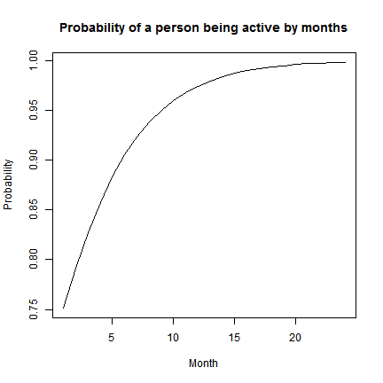

<style>
pre code, pre, code {
  white-space: pre !important;
  overflow-x: scroll !important;
  word-break: keep-all !important;
  word-wrap: initial !important;
}

aside.gdbar img{
  
  width: 80px;
  height: 80px;


}

div.centered {

  text-align: left;


}

/*
code.coffeescript {

  font-size: 5px;

}
*/

code.r{ /* Code block */
  font-size: 15px;
}

code.vhdl{

  font-size: 15px;

}

code.parser3 {
  font-size: 50%;

}

</style>

## Churn Prediction Brief 
<br>
<br>
<br>
<br>
<br>
<br>
 <center></center>

---

## What is Churn Prediction
<br>
> - # Survival Analysis
     - First used in clinical trials and the event of interest was dead or alive.

> - # Now it is widely used to predict the probability of occurrence of an event.
     - In a dataset   
        - 1: an event occurred
        - 0: an event didn't occur

---

## The purpose of Churner Prediction
<br>
> - # Find people who are likely to churn.


> - # Try to find a way to interact with them and keep them on board.

> - # Improve our retention rate.

---

## The process of Churn Prediction
<br>
> - # Choose historical data

> - # Build model based on historical data
     - Significant variables and their weight (coefficient) can be picked out.
    
> - # Apply the coefficient (weight) of variables on our current active members and get probability
> - # Pick up the first 1000 people with lowest probability


--- &twocol

## The variables we would like to look at

*** =left

>  Categorical Data  

   - Membership Status (1, 0)
   - Gender
   - Sign Up source
   - Frequency
   - Ever Saved?
   - Upgrade?
   - DD dishonoured?
   - ChargeBack

*** =right
      
>  Numeric Data  

   - Income
   - Recurring gift amount
   - Recurring first gift amount
   - Recurring last gift amount
   - Total gift amount
   - Total number of gifts
   - Age
   - Duration (Since the most recent sign up date)


---


## Model Prediction

<br>
# Choose all sign ups from the 2015-06-01 to 2016-05-31.

- Choose all the variables we would like to look at.


```
  Constituent_ID Age Gender Income Assigned_Fundraiser Sign_Up_Amount      Frequency Current_Status Status.Indicator First_Gift_Amount Last_Gift_Amount Saved Duration Upgrade Total_Number_Of_Gifts Total_Gift_Amount DDD CCC Times DDDown
1         108859  68 Female  45000      Telefundraiser             35 MONTHLY GIVING         Active                1                25               35     0       10       1                    61              1145   0   0     2      0
2         121705  84 Female      0           Canvasser             25 MONTHLY GIVING     Terminated                0                25               25     0        1       0                     2                50   0   0     1      0
3         123157  59   Male      0      Telefundraiser             30 MONTHLY GIVING     Terminated                0                30               30     0       10       0                   198              2745   0   0     2      0
4          16717  83 Female  75000           Canvasser             25 MONTHLY GIVING         Active                1                 0                0     0       16       0                     0                 0   0   1     1      0
5          17349   0 Female  80700      Telefundraiser             50 MONTHLY GIVING         Active                1                50               50     0       10       0                    22               950   0   0     2      0
6          28989   0 Female  51700      Telefundraiser             26 MONTHLY GIVING         Active                1                26               26     0       11       0                    24               617   0   0     2      0
```


---

## Model Prediction
<br>
# Changing character/text variables into factors

> - # Values in `Current_Status`, `Gender`, `Assigned_Fundraiser` and all other categorical variables should be changed into numbers
       - `Active`, `Terminated` will become 1, 0
       - `Female`, `Male`, `Unknown` will become 1, 2, 3
       - `Telefundraiser`, `Canvasser`, `Frontliner`, `WEB`, `Saver` will become 1, 2, 3, 4, 5
<br>

> - # The numbers here are not really numeric. It only tells the programme which is first category, second category and etc. 

---

## Model Prediction

- # Check correlation between variables 

- # Some numeric variables are checked here


```r
options(width=300)
round(cor(df[,c("Income", "Age", "Sign_Up_Amount", 
                "First_Gift_Amount", "Last_Gift_Amount", 
                "Total_Number_Of_Gifts", "Total_Gift_Amount", "Times")]),2)
```

```
                      Income   Age Sign_Up_Amount First_Gift_Amount Last_Gift_Amount Total_Number_Of_Gifts Total_Gift_Amount Times
Income                  1.00 -0.01           0.03              0.07             0.06                  0.06              0.09 -0.01
Age                    -0.01  1.00           0.02             -0.01             0.01                  0.09              0.09  0.11
Sign_Up_Amount          0.03  0.02           1.00              0.55             0.70                  0.03              0.28  0.07
First_Gift_Amount       0.07 -0.01           0.55              1.00             0.88                  0.11              0.27  0.03
Last_Gift_Amount        0.06  0.01           0.70              0.88             1.00                  0.11              0.36  0.05
Total_Number_Of_Gifts   0.06  0.09           0.03              0.11             0.11                  1.00              0.79  0.53
Total_Gift_Amount       0.09  0.09           0.28              0.27             0.36                  0.79              1.00  0.45
Times                  -0.01  0.11           0.07              0.03             0.05                  0.53              0.45  1.00
```

<!--
---

## Model Prediction

- # 

- # A visualized way to see how some of the variables are correlated


```r
plot(df[, c("Sign_Up_Amount", "First_Gift_Amount", "Last_Gift_Amount", "Total_Number_Of_Gifts", "Total_Gift_Amount")])
```


-->


---

## Model Prediction

- # Correlation matrix tells us some of the variable are highly correlated (collinearity ).

- # This means those variables can't be used in the model at the same time.

- # Which variable should be used?

---

## Model Prediction

- # A simple approach to identify collinearity among explanatory variables is the use of variance inflation factors (`VIF`)

- # The higher the value, the higher the collinearity


```r
options(width=300)
vif <- diag(solve(cor(df[,c("Income", "Age", "Sign_Up_Amount", 
                "First_Gift_Amount", "Last_Gift_Amount", 
                "Total_Number_Of_Gifts", "Total_Gift_Amount", "Times")])))
vif
```

```
               Income                   Age        Sign_Up_Amount     First_Gift_Amount      Last_Gift_Amount Total_Number_Of_Gifts     Total_Gift_Amount                 Times 
             1.013195              1.015675              2.091509              4.798189              6.827333              3.353585              3.513616              1.416261 
```

- # 

- # From the result we can tell we should firstly remove `Last_Gift_Amount` first

--- 

## Model Prediction
<br>
# Logistic regression is used. It deals with scenarios with 2 outcomes.

<br>
Logistic regression is part of <font color="red">G</font>eneralized <font color="red">L</font>inear <font color="red">M</font>odel (`GLM`) family

The syntax of a `logistic` regression will be like the script below


```r
my_model <- glm(Status.Indicator ~ Age + Gender + Income + Assigned_Fundraier + ..., 
                data = df,
                family = binomial(logit))
```

--- &twocol

## Model Prediction
- # 

- # Logistic regression gives us the coefficients of all variables that are included in the model.

*** =left


```r
my_model <- glm(Status.Indicator ~ Age 
                 + Gender 
                 + Income
                 + Assigned_Fundraiser 
                 + Sign_Up_Amount 
                 + Frequency 
                 #+ First_Gift_Amount 
                 #+ Last_Gift_Amount 
                 #+ Saved 
                 #+ Upgrade 
                 #+ Total_Number_Of_Gifts
                 + Total_Gift_Amount
                 + Duration
                 + DDD 
                 + CCC 
                 + Times 
                 #+ DDDown
                 , 
                 data = df,
                 family = binomial(logit)
                )
```


*** =right


```

Call:
glm(formula = Status.Indicator ~ Age + Gender + Income + Assigned_Fundraiser + 
    Sign_Up_Amount + Frequency + Total_Gift_Amount + Duration + 
    DDD + CCC + Times, family = binomial(logit), data = df)

Deviance Residuals: 
    Min       1Q   Median       3Q      Max  
-8.4904  -0.7957   0.2675   0.8649   3.6148  

Coefficients:
                                    Estimate Std. Error z value Pr(>|z|)    
(Intercept)                        8.759e+00  9.054e-01   9.674  < 2e-16 ***
Age                                4.190e-03  1.287e-03   3.256  0.00113 ** 
GenderMale                         1.143e-01  5.284e-02   2.163  0.03057 *  
GenderUnknown                      3.150e-02  7.283e-02   0.433  0.66537    
Income                            -4.999e-06  9.270e-07  -5.393 6.93e-08 ***
Assigned_FundraiserCanvasser      -1.317e+00  8.828e-02 -14.921  < 2e-16 ***
Assigned_FundraiserFrontliner     -2.242e+00  2.355e-01  -9.519  < 2e-16 ***
Assigned_FundraiserSaver          -1.365e+00  1.091e-01 -12.511  < 2e-16 ***
Assigned_FundraiserTelefundraiser -7.964e-01  9.153e-02  -8.701  < 2e-16 ***
Assigned_FundraiserWEB            -9.677e-02  2.212e-01  -0.437  0.66175    
Sign_Up_Amount                    -3.232e-02  2.020e-03 -16.001  < 2e-16 ***
FrequencyMONTHLY GIVING           -7.543e+00  8.682e-01  -8.688  < 2e-16 ***
Total_Gift_Amount                  3.642e-03  1.685e-04  21.616  < 2e-16 ***
Duration                           2.302e-01  7.908e-03  29.108  < 2e-16 ***
DDD1                              -1.081e+00  1.052e-01 -10.277  < 2e-16 ***
CCC1                              -2.144e-01  9.645e-02  -2.223  0.02621 *  
Times                             -5.976e-01  8.347e-02  -7.159 8.13e-13 ***
---
Signif. codes:  0 '***' 0.001 '**' 0.01 '*' 0.05 '.' 0.1 ' ' 1

(Dispersion parameter for binomial family taken to be 1)

    Null deviance: 13916  on 10071  degrees of freedom
Residual deviance: 10460  on 10055  degrees of freedom
AIC: 10494

Number of Fisher Scoring iterations: 6
```

---
## How to use the output of the model
<br>
- # 

- # On the paper

$$\pi = \frac{exp(\beta_0 + \beta_1V_1 + \beta_2V_2 + ...)}{1 + exp(\beta_0 + \beta_1V_1 + \beta_2V_2 + ...)}$$
<br>

> - # $\beta_0, \beta_1, \beta_2, ...$ are the coefficients
        
> - # $V_1, V_2, ...$ are the significant variables

---

## How to use the output of the model
<br>
- # 

- # Using R `predict()` function


```r
prob <- predict(my_model, df, type = "response")
```
   
>  - # Data set `df` should contain the exact variables used in the model

>  - # Please note:
       > - If we want to use `predict()` to calculate the probability of the response variable for a given dataset, `type="response"` should be specified
       > - Otherwise, the result will be the some other value but still related to probability (log-odds)

--- &twocol

## How to use the output of the model

- # 

- # Predict the probability of a person still with us after a certain amount of time

*** =left


```r
df.test <- data.frame(Age = 27, 
                      Gender = as.factor("Female"), 
                      Income = 30800, 
                      Assigned_Fundraiser = as.factor("Agency FR"),
                      Frequency = as.factor("MONTHLY GIVING"), 
                      Duration = c(1:24),
                      Sign_Up_Amount = 10, 
                      Total_Gift_Amount = 171,
                      DDD = as.factor(0), 
                      CCC = as.factor(0),
                      Times=1)

prob.test <- predict(my_model, df.test, type = "response")
plot(prob.test, type = "l", 
     main = "Probability of a person being active by months", 
     ylab = "Probability",
     xlab = "Month")
```


*** =right




---

## How do we target people
<br>

- # Apply the coefficients on current active members we can produce the probability of a person stays with us in the future.

- # We pick out people with low probability.


---

## Accuracy of Current Model
<br>
- # 

- # Currently we can pick out 16.7% of our monthly cancellations

---

## Questions?


